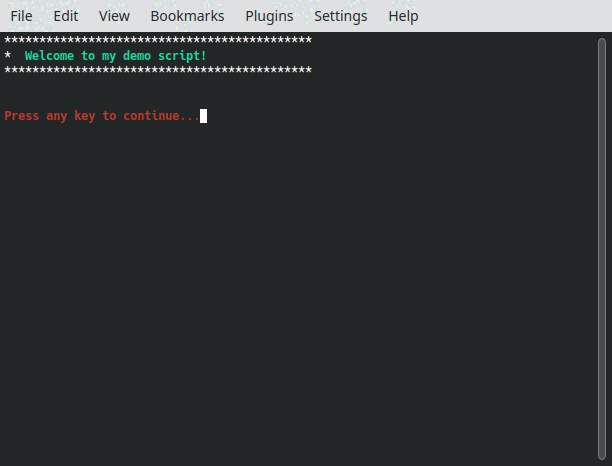

# Problem
* Have you ever given a demo of software that involved a terminal?
* How many typos did you make?
* Did it not work the same way just a minute ago?

If you answer yes to any of these I have some difficult news: **Your demo was bad!**

It's okay, I've had demos like this too.

# Solution
Here is simple set of Bash utility functions that help guide an audience through
the function of a piece of software. 

Now you can: 
* Stay focused on the narrative
* Avoid typos and other mistakes
* Look like you've got your stuff together!

# How To Use
1) Copy `demo-example.bash` and `demo-utils.bash` to the directory you want to work in.
2) Modify `demo-example.bash` so that it runs _your software_.
3) **Profit!**

